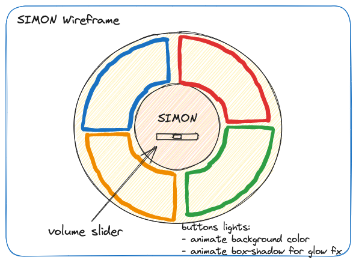

# SIMON Clone

*Wireframe Draft*

Re-creation of the classic Simon game, using HTML, Typescript, and CSS.

A live build will be hosted and available here once it has been released.

## Installation
With NodeJS installed on your machine, run `npm init`, and `npm run start`.

All deliverables should then be available in `dist/`.

## Goals
- Create simple, but nice front-end design
- Learn/Use Web Audio API, fallback to `<audio>`

## MVP
- 4 Buttons
- Game Loop:
  - Game plays a sequence of buttons one at a time, one added each turn
    - button lights up
    - play unique sound per button
  - Player must press buttons in the same order once sequence has finished
    - Limit the time to get button
  - If player runs out of time or presses the wrong button, show score

## Game States

### 1. Standby
Wait for user interaction. 
Present a start button.
- This will allow for audio to work, since we need an
interaction on Chrome and other popular browsers before
any audio can play.

### 2. GamePlay
Main gameplay loop

#### - CountDown
Initialize props and state variables.
Show a countdown overlay to prepare the player: 3, 2, 1, Start!

#### - PlayTones
Game will play sequence of tones back to the player, at the speed
that they must respond with. When sequence ends, wait for player button press,
then move to Response state.

#### - Response
Player must replay the tones in the correct order and within click time.

Limit time between clicks (add slight buffer). If this time is exceeded or 
player enters the wrong tone, player loses, go to *3. Result* screen.
If correct, unset timeout, and fire another one until all correct tones played.
If all are correct, go to *RewardTone*.

#### - RewardTone
Check if player has reached 10, 20, or 30 points, play a short rewarding sfx.
Go to *PlayTones* game state.

### 3. Result
Show score, play sfx depending on how many points player achieved.

Wait a couple seconds, then fade in a "Play again?" button.
If this button is pressed, go to state *2. GamePlay*

## Model 

### State
- turnNumber
- playerProgress
- speed
  - Calculated via turnNumber
- gameState
  - Contains the states listed above in an enum

### Props
Set only once at the beginning of each game.

- Cached html elements
- Button tones sfx files perhaps pitch shifted
- Randomized sequence

### "Nice to Haves"

- Difficulty mode (speed inclines quicker)
- Diversify tones in different keys (player must adjust to new tones every time)
- Music on the standby screen & result screen
- Add more buttons
