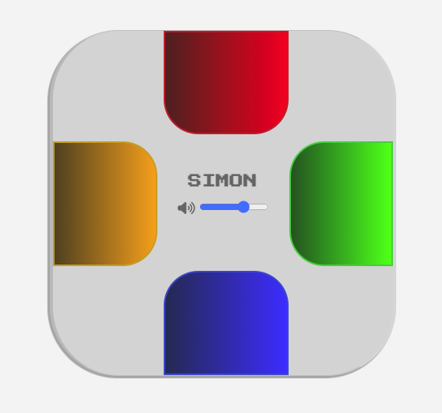

# Simon Game Clone



Re-creation of the classic Simon game, using HTML, Typescript, and CSS.

A live build can be found [here](https://code.aaronishibashi.com/simon/).

## Technologies Used


## Installation

To build and run the project in a local server:

```shell
npm install
npm run serve
``` 
or
```shell
yarn install
yarn serve
```

## Features
- Simple and usable front-end design
- Pure Web Audio API synthesis besides reverb

## Known Issues
- Audio is distorted on Brave, due to differences in Web Audio API impelmentation
- No mobile support

## Future
- [ ] Mobile support
- [ ] Audio fallback to `<audio>` when WebAudio API not available
- [ ] Difficulty mode (speed inclines quicker)
- [ ] Diversify tones in different keys (player must adjust to new tones every time)
- [ ] Music on the standby screen & result screen
- [ ] Add more buttons
